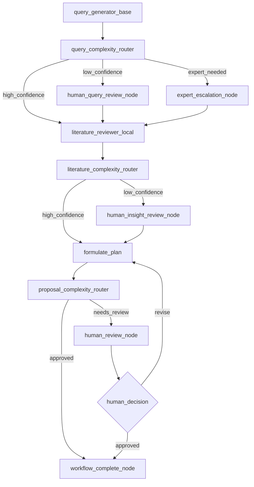

# Intelligent Human-in-the-Loop Routing Design

## 1. Overview

This document outlines the integration of intelligent routing into the Research Proposal Agent to dynamically determine when human intervention is needed, rather than using fixed HIL checkpoints. This builds upon the existing DSPy integration plan and draws inspiration from [Not Diamond's HIL routing approach](https://docs.notdiamond.ai/docs/human-in-the-loop-routing).

## 2. Current State Analysis

### Current HIL Architecture (Fixed Checkpoints)
```
query_generation → HIL (always) → literature_review → HIL (always) → proposal_creation → HIL (always)
```

**Problems with Fixed HIL:**
- 100% human review burden, even for simple/obvious cases
- Slower processing for routine requests
- Human fatigue from reviewing trivial decisions
- Not scalable for high-volume usage

### Existing Components to Leverage
- ✅ **LangGraph Structure**: Already supports conditional routing and interrupts
- ✅ **HIL Infrastructure**: `hil_nodes.py` with interrupt() pattern
- ✅ **State Management**: Rich state tracking in `ProposalAgentState`
- ✅ **Configuration System**: JSON-based workflow and HIL configurations

## 3. Intelligent Routing Architecture

### 3.1 Routing Decision Framework

**Three-Tier Routing Strategy:**
1. **Auto-Continue**: High confidence LLM predictions (70-80% of cases)
2. **Human Review**: Low confidence or complex cases (15-25% of cases)  
3. **Expert Escalation**: Critical failures or edge cases (5% of cases)

### 3.2 Router Components

```python
# New routing components to implement
class StageComplexityRouter(dspy.Module):
    """Determines if a stage output needs human review"""
    
class ConfidenceEstimator(dspy.Module):
    """Estimates LLM confidence in its output"""
    
class QualityScorer(dspy.Module):
    """Scores output quality to aid routing decisions"""
```

## 4. Implementation Plan

### Phase 1: Router Infrastructure (2-3 days)

**Task 1.1: Create Router Modules**
- **File**: `core/proposal_agent/routing_modules.py`
- **Content**: DSPy-based routers for each stage
- **Routers**:
  - `QueryComplexityRouter`: Routes query generation decisions
  - `LiteratureComplexityRouter`: Routes literature review decisions  
  - `ProposalComplexityRouter`: Routes final proposal decisions

**Task 1.2: Routing Configuration**
- **File**: `core/proposal_agent/routing_config.json`
- **Content**: Thresholds, weights, and routing logic per stage

**Task 1.3: Enhanced HIL Nodes**
- **Modify**: `core/proposal_agent/hil_nodes.py`
- **Add**: Conditional HIL logic that checks router decisions

### Phase 2: Graph Integration (1-2 days)

**Task 2.1: Conditional HIL Edges**
- **Modify**: `core/proposal_agent/modern_graph_builder.py`
- **Add**: Router-based conditional edges instead of fixed HIL paths

**Task 2.2: Router Node Creation**
- **Add**: Router nodes to the graph that evaluate before each potential HIL
- **Pattern**: `stage_node → router_node → [continue_path | hil_path]`

### Phase 3: Training Data & Optimization (3-4 days)

**Task 3.1: Collect Training Data**
- **Source**: Historical proposal agent runs
- **Label**: Which cases actually needed human intervention
- **Format**: `dspy.Example` objects with input features and routing decisions

**Task 3.2: Router Training**
- **Script**: `core/proposal_agent/train_routers.py`
- **Process**: Use `dspy.BootstrapFewShot` to optimize routing decisions
- **Metrics**: Precision/recall on human intervention necessity

### Phase 4: Evaluation & Tuning (2-3 days)

**Task 4.1: A/B Testing Framework**
- **Compare**: Fixed HIL vs. Intelligent routing
- **Metrics**: Human review rate, user satisfaction, processing time

**Task 4.2: Threshold Tuning**
- **Optimize**: Confidence thresholds for each routing decision
- **Target**: 20-30% human review rate with maintained quality

## 5. Technical Architecture

### 5.1 New File Structure
```
core/proposal_agent/
├── routing_modules.py          # DSPy routing components
├── routing_config.json         # Routing thresholds and settings
├── train_routers.py           # Router training scripts
├── routing_training_data/     # Training data for routers
└── smart_hil_nodes.py         # Enhanced HIL with routing logic
```

### 5.2 Router Integration Pattern

```python
# Example routing integration
def smart_query_review_stage(state: ProposalAgentState) -> Dict[str, Any]:
    """Query generation with intelligent routing"""
    
    # Generate queries (existing logic)
    queries = generate_queries_with_dspy(state.topic)
    
    # Route decision
    router_decision = query_complexity_router(
        topic=state.topic,
        queries=queries,
        user_history=state.get('user_profile', {})
    )
    
    if router_decision.route == "auto_continue":
        # High confidence - skip human review
        return {"search_queries": queries, "routing_decision": "auto"}
    elif router_decision.route == "human_review":
        # Low confidence - trigger HIL
        return {"search_queries": queries, "needs_human_review": True}
    else:
        # Expert escalation
        return {"search_queries": queries, "needs_expert_review": True}
```

### 5.3 Enhanced Graph Flow



## 6. Router Feature Engineering

### 6.1 Query Complexity Features
```python
QueryFeatures = {
    "topic_clarity": float,          # How well-defined is the topic?
    "domain_familiarity": float,     # Is this a common research area?
    "query_specificity": float,      # Are generated queries specific enough?
    "potential_result_count": int,   # Estimated paper matches
    "user_expertise_level": str      # Novice/intermediate/expert
}
```

### 6.2 Literature Review Complexity Features
```python
LiteratureFeatures = {
    "summary_coherence": float,      # Do summaries make sense together?
    "knowledge_gap_clarity": float,  # Is the gap well-articulated?
    "citation_quality": float,       # Are citations appropriate?
    "synthesis_depth": float,        # How deep is the analysis?
    "conflicting_evidence": bool     # Are there contradictions?
}
```

### 6.3 Proposal Complexity Features
```python
ProposalFeatures = {
    "feasibility_score": float,      # How realistic is the proposal?
    "novelty_score": float,          # How novel is the research?
    "methodology_clarity": float,    # Is the approach clear?
    "ai_reviewer_agreement": float,  # Do AI reviewers agree?
    "proposal_completeness": float   # Are all sections complete?
}
```

## 7. Routing Configuration

### 7.1 Confidence Thresholds (routing_config.json)
```json
{
  "routing_thresholds": {
    "query_generation": {
      "auto_continue_threshold": 0.8,
      "expert_escalation_threshold": 0.3,
      "features_weights": {
        "topic_clarity": 0.3,
        "domain_familiarity": 0.25,
        "query_specificity": 0.25,
        "user_expertise_level": 0.2
      }
    },
    "literature_review": {
      "auto_continue_threshold": 0.75,
      "expert_escalation_threshold": 0.25,
      "features_weights": {
        "summary_coherence": 0.3,
        "knowledge_gap_clarity": 0.3,
        "citation_quality": 0.2,
        "synthesis_depth": 0.2
      }
    },
    "final_review": {
      "auto_continue_threshold": 0.7,
      "expert_escalation_threshold": 0.2,
      "features_weights": {
        "feasibility_score": 0.25,
        "novelty_score": 0.25,
        "methodology_clarity": 0.25,
        "ai_reviewer_agreement": 0.25
      }
    }
  },
  "user_profiles": {
    "novice": {"confidence_penalty": 0.1},
    "intermediate": {"confidence_penalty": 0.0},
    "expert": {"confidence_bonus": 0.1}
  }
}
```

## 8. Expected Benefits

### 8.1 Efficiency Gains
- **Reduced Human Load**: From 100% to ~25% review rate
- **Faster Processing**: Auto-continue cases complete in minutes vs hours
- **Better Resource Allocation**: Humans focus on genuinely complex cases

### 8.2 Quality Improvements  
- **Consistency**: AI handles routine cases consistently
- **Expertise Focus**: Humans review only cases that need expert judgment
- **Learning Loop**: Router improves over time with more data

### 8.3 User Experience
- **Faster Results**: Straightforward requests complete quickly
- **Transparency**: Users understand why their case needs review
- **Personalization**: Routing adapts to user expertise level

## 9. Risk Mitigation

### 9.1 Quality Assurance
- **Fallback to HIL**: When in doubt, always route to human review
- **Audit Trail**: Track all routing decisions for analysis
- **Override Mechanism**: Users can request human review regardless of routing

### 9.2 Gradual Rollout
- **Conservative Thresholds**: Start with low auto-continue rates
- **Staged Deployment**: Roll out one stage at a time
- **Monitor & Adjust**: Continuously tune based on outcomes

### 9.3 Human-AI Collaboration
- **Explainable Routing**: Show users why their case was routed to HIL
- **Feedback Loop**: Learn from human corrections to routing decisions
- **Expert Override**: Domain experts can adjust routing logic

## 10. Success Metrics

### 10.1 Efficiency Metrics
- **Human Review Rate**: Target 20-30% (down from 100%)
- **Processing Time**: <5 minutes for auto-continue cases
- **Throughput**: 3-4x more proposals processed per day

### 10.2 Quality Metrics  
- **User Satisfaction**: Maintain >85% satisfaction rate
- **Accuracy**: Routing precision >90% (correct auto-continue decisions)
- **Recall**: Routing recall >95% (catch cases needing human review)

### 10.3 Learning Metrics
- **Router Improvement**: Accuracy increases over time
- **Threshold Optimization**: Convergence to optimal thresholds
- **Feature Importance**: Understanding which features matter most

This intelligent routing system will transform the proposal agent from a "human-required" system to a "human-enhanced" system, providing the best of both worlds: AI efficiency for routine cases and human expertise for complex decisions. 