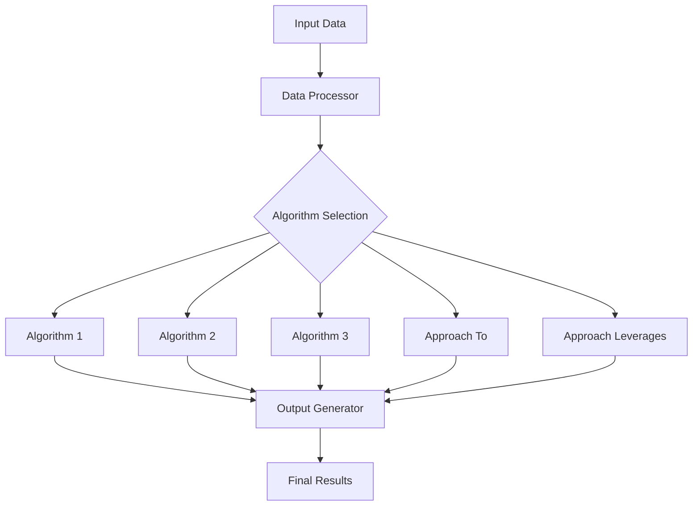

# Implementation Diagrams

## System Architecture

```mermaid
flowchart TD
    A[Input Data] --> B[Data Processor]
    B --> C{Algorithm Selection}
    C --> D1[Algorithm 1]
    C --> D2[Algorithm 2]
    C --> D3[Algorithm 3]
    C --> D4[Approach To]
    C --> D5[Approach Leverages]
    D1 --> E[Output Generator]
    D2 --> E[Output Generator]
    D3 --> E[Output Generator]
    D4 --> E[Output Generator]
    D5 --> E[Output Generator]
    E --> F[Final Results]
```

