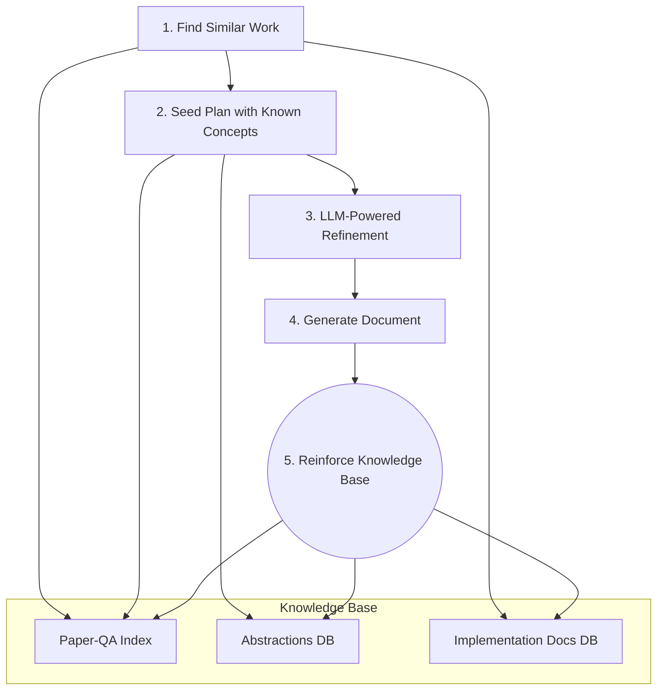

# KAG: Knowledge-Augmented Generation Implementation Plan

This document outlines a new architectural approach, "Knowledge-Augmented Generation" (KAG), which replaces the linear pipeline in `IMPLEMENTATION_PLAN.md` with a dynamic, knowledge-driven workflow.

## Core Concept: From Linear Pipeline to a Flywheel

The current plan treats each paper in isolation. The KAG approach creates a "flywheel" effect: every paper processed makes the system smarter and faster for the next one. This is achieved by building and constantly reinforcing a central Knowledge Base.

### The Knowledge Base Components:

1.  **`Paper-QA` Document Index:** This is the foundation. All source papers are ingested into a `Paper-QA` collection, which handles PDF parsing, chunking, embedding, and hybrid search (keyword + semantic). This replaces **Iteration 1**.
2.  **Abstractions & Connections Database:** A global, structured repository of all abstractions (algorithms, datasets, etc.) and their relationships (dependencies, workflows) identified across *all* papers. Each entry is linked back to its source paper and chunk in the `Paper-QA` index. This is the "collective intelligence" store, evolving the outputs of **Iterations 3 & 4**.
3.  **Implementation Document Store:** A searchable database of all *final generated documents*. This allows us to find and reuse entire implementation plans from past work.

---

## The New Workflow: Retrieve, Refine, and Reinforce

Instead of a rigid 9-step plan, the workflow becomes a dynamic, 5-stage loop.

### Stage 1: Find Similar Work
When tasked with a new paper, we first query the entire Knowledge Base to see what we already know.
-   **Query 1 (Similar Papers):** Use the new paper's abstract to do a semantic search on the `Paper-QA` index to find the most conceptually similar papers.
-   **Query 2 (Similar Plans):** Use the new paper's abstract to search the *Implementation Document Store* for previously generated plans that are highly relevant.
-   **Outcome:** You immediately have context. Instead of starting from zero, you might find a nearly identical plan that just needs adaptation.

### Stage 2: Seed the Plan with Known Concepts
This completely changes how abstractions are identified.
-   **Old way:** Run detection rules and LLM calls on the raw text of one paper.
-   **New way:** For each section of the new paper, perform a semantic search against the *entire `Paper-QA` index* to find the most similar text chunks from *all other papers*. Then, retrieve the pre-identified **abstractions and connections** associated with those chunks from your database.
-   **Outcome:** A high-quality "draft plan" is created almost instantly, seeded with concepts the system already understands.

### Stage 3: LLM-Powered Refinement
This makes the LLM's job easier and more reliable. The task is no longer discovery, but validation and adaptation.
-   The LLM is prompted with the new paper's text and the seeded plan from Stage 2.
-   **Prompt:** *"Here is a new paper and a draft implementation plan based on similar work. Please validate this plan against the new paper. Correct any inaccuracies, fill in missing details, and identify any truly novel concepts."*
-   **Outcome:** A complete and accurate plan that combines reused knowledge with the specific novelties of the target paper.

### Stage 4: Generate Document
This proceeds similarly to **Iterations 5-7** of the original plan, but it's enhanced by the Knowledge Base. When summarizing a common abstraction like "self-attention," the system can pull a high-quality, pre-existing summary from the Abstractions DB instead of writing a new one.

### Stage 5: Reinforce the Knowledge Base
This is the critical step that powers the flywheel.
-   The newly generated document is saved to the *Implementation Document Store*.
-   The validated abstractions and connections are saved to the *Abstractions & Connections Database*.
-   **Outcome:** The Knowledge Base is now richer, improving the speed and quality of results for the next paper.

---

## Advantages of the KAG Approach

-   **Reusability:** Drastically reduces redundant work. Concepts are analyzed and described once, then reused.
-   **Efficiency:** Generating plans for papers in a known domain becomes exponentially faster.
-   **Higher Quality & Consistency:** By starting from validated plans and summaries, the output is more reliable and maintains consistent terminology.
-   **Scalability:** The system's value grows with its usage, embodying a true network effect.
-   **Alignment with `Paper-QA`:** Leverages the core strengths of `Paper-QA` for search, retrieval, and document management.

This approach transforms the project from a static document converter into a dynamic, learning system for understanding and implementing technical papers. 